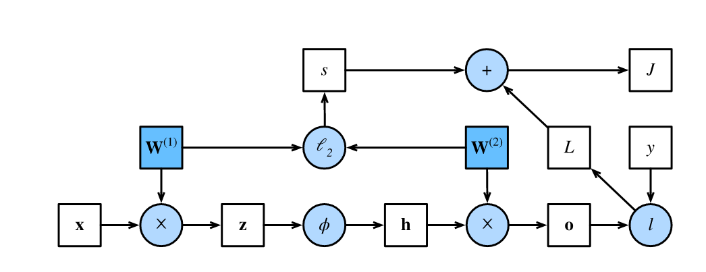

# 前向传播
**前向传播**（forward propagation）：按顺序（输入层$\to$输出层）计算和存储神经网络中每层的结果。

讨论示例：
预设：隐藏层不包括偏置项
- 输入样本$\mathbf{x}\in \mathbb{R}^d$
- 隐藏层的权重参数$\mathbf{W}^{(1)} \in \mathbb{R}^{h \times d}$
- 中间变量$\mathbf{z}= \mathbf{W}^{(1)} \mathbf{x}$
    - $\mathbf{z}\in \mathbb{R}^h$
- 激活函数$\phi$
- 隐藏激活向量$\mathbf{h}= \phi (\mathbf{z})$
    - $\mathbf{h}\in \mathbb{R}^h$
- 输出层的权重参数$\mathbf{W}^{(2)} \in \mathbb{R}^{q \times h}$
- 输出层变量$\mathbf{o}= \mathbf{W}^{(2)} \mathbf{h}$
    - $\mathbf{o}\in \mathbb{R}^q$
- 单个数据样本的损失项$L = l(\mathbf{o}, y)$
    - 损失函数$l$
    - 样本标签$y$
- 正则化项$s = \frac{\lambda}{2} \left(\|\mathbf{W}^{(1)}\|_F^2 + \|\mathbf{W}^{(2)}\|_F^2\right)$
    - $L_2$正则化
    - 超参数$\lambda$
- 模型在给定数据样本上的正则化损失$J = L + s$
    - 即此时的**目标函数**（objective function）。

- 正方形表示变量，圆圈表示操作符。
- 左下角表示输入，右上角表示输出。
- 箭头显示数据流的方向，主要是向右和向上。

# 反向传播

**反向传播**（backward propagation）：计算神经网络参数梯度的方法。
根据微积分中的<u>链式法则</u>，按相反的顺序从输出层到输入层遍历网络。
- 存储计算某些参数梯度时所需的任何中间变量（偏导数）
- $\text{prod}$运算符：在执行必要的操作（如换位和交换输入位置）后将其参数相乘。
- 目的：计算梯度$\frac{\partial J}{\partial \mathbf{W}^{(1)}}$和$\frac{\partial J}{\partial \mathbf{W}^{(2)}}$
    - 先计算距离输出层更近的$\frac{\partial J}{\partial \mathbf{W}^{(2)}}$

$$
\begin{align*}
    \frac{\partial J}{\partial \mathbf{W}^{(2)}}
    &= \frac{\partial J}{\partial L}\cdot \frac{\partial L}{\partial \mathbf{W}^{(2)}}
    +\frac{\partial J}{\partial s}\cdot \frac{\partial s}{\partial \mathbf{W}^{(2)}} \\
    &= 1\cdot \frac{\partial L}{\partial \mathbf{W}^{(2)}}
    +\ 1\cdot \frac{\partial s}{\partial \mathbf{W}^{(2)}} \\
    &= \frac{\partial L}{\partial \mathbf{o}} \cdot \frac{\partial \mathbf{o}}{\partial \mathbf{W}^{(2)}}
    + \lambda \mathbf{W}^{(2)}\\
    &=\frac{\partial L}{\partial \mathbf{o}}
    \cdot \mathbf{h}^\top
    + \lambda \mathbf{W}^{(2)}\\
\end{align*}
$$

$$
\begin{align*}
    \frac{\partial J}{\partial \mathbf{W}^{(1)}}
    &= \frac{\partial J}{\partial L}\cdot \frac{\partial L}{\partial \mathbf{W}^{(1)}}
    +\frac{\partial J}{\partial s}\cdot \frac{\partial s}{\partial \mathbf{W}^{(1)}} \\
    &= 1\cdot \frac{\partial L}{\partial \mathbf{W}^{(1)}}
    +\ 1\cdot \frac{\partial s}{\partial \mathbf{W}^{(1)}} \\
    &= \frac{\partial L}{\partial \mathbf{o}} \cdot \frac{\partial \mathbf{o}}{\partial \mathbf{W}^{(1)}}
    + \lambda \mathbf{W}^{(1)}\\
    &=\frac{\partial L}{\partial \mathbf{o}}
    \cdot \frac{\partial \mathbf{o}}{\partial \mathbf{h}}
    \cdot \frac{\partial \mathbf{h}}{\partial \mathbf{W}^{(1)}}
    + \lambda \mathbf{W}^{(1)}\\
    &=({\mathbf{W}^{(2)}}^\top \cdot \frac{\partial L}{\partial \mathbf{o}})
    \cdot \frac{\partial \mathbf{h}}{\partial \mathbf{W}^{(1)}}
    + \lambda \mathbf{W}^{(1)}\\
    &=({\mathbf{W}^{(2)}}^\top \cdot \frac{\partial L}{\partial \mathbf{o}})
    \cdot \frac{\partial \mathbf{h}}{\partial \mathbf{z}}
    \cdot \frac{\partial \mathbf{z}}{\partial \mathbf{W}^{(1)}}
    + \lambda \mathbf{W}^{(1)}\\
    &=({\mathbf{W}^{(2)}}^\top \cdot \frac{\partial L}{\partial \mathbf{o}})
    \odot \phi'\left(\mathbf{z}\right)
    \cdot \mathbf{x}^\top
    + \lambda \mathbf{W}^{(1)}\\
\end{align*}
$$

由于$\frac{\partial J}{\partial L}=1$，故$\frac{\partial L}{\partial \mathbf{h}}$在数值上等于$\frac{\partial J}{\partial \mathbf{h}}$，下述$\frac{\partial J}{\partial \mathbf{h}}$、$\frac{\partial J}{\partial \mathbf{z}}$按此对应上述推导。

激活函数$\phi$是按元素计算的，计算中间变量$\mathbf{z}$的梯度$\frac{\partial J}{\partial \mathbf{z}} \in \mathbb{R}^h$
需要使用按元素乘法运算符，用$\odot$表示：

$$
\frac{\partial J}{\partial \mathbf{z}}
= \text{prod}\left(\frac{\partial J}{\partial \mathbf{h}}, \frac{\partial \mathbf{h}}{\partial \mathbf{z}}\right)
= \frac{\partial J}{\partial \mathbf{h}} \odot \phi'\left(\mathbf{z}\right)
$$

隐藏层输出的梯度$\frac{\partial J}{\partial \mathbf{h}} \in \mathbb{R}^h$由下式给出：

$$
\frac{\partial J}{\partial \mathbf{h}}
= \text{prod}\left(\frac{\partial J}{\partial \mathbf{o}}, \frac{\partial \mathbf{o}}{\partial \mathbf{h}}\right)
= {\mathbf{W}^{(2)}}^\top \frac{\partial J}{\partial \mathbf{o}}
$$

$J$ 是一个标量（损失函数的输出），$\mathbf{o}$ 是 $q$ 维向量，按照多元微积分，$\frac{\partial J}{\partial \mathbf{o}}$形状和 $\mathbf{o}$ 一致，即 $\frac{\partial J}{\partial \mathbf{o}} \in \mathbb{R}^q$；又$\mathbf{W}^{(2)} \in \mathbb{R}^{q \times h}$，故：
$$
{{\mathbf{W}^{(2)}}^\top \frac{\partial J}{\partial \mathbf{o}}} \in \mathbb{R}^h
$$

> ${{\mathbf{W}^{(2)}}^\top \frac{\partial J}{\partial \mathbf{o}}}$与${\frac{\partial J}{\partial \mathbf{o}} \cdot \mathbf{W}^{(2)}}$

在**反向传播的推导**中，更常用${{\mathbf{W}^{(2)}}^\top \frac{\partial J}{\partial \mathbf{o}}}$ 的写法，主要考虑以下：
1. 链式法则
   通过**上一层的梯度左乘该层权重的转置**，得到每一层的梯度
2. 与前向传播的结构对偶
   - 前向传播：$\mathbf{o} = \mathbf{W}^{(2)} \mathbf{h}$
   - 反向传播：$\frac{\partial J}{\partial \mathbf{h}} = {\mathbf{W}^{(2)}}^\top \frac{\partial J}{\partial \mathbf{o}}$

对于$\mathbf{W}^{(2)} \in \mathbb{R}^{q \times h}$，为了在计算$\frac{\partial J}{\partial \mathbf{h}}$时形状匹配：
- $\frac{\partial J}{\partial \mathbf{h}} = {{\mathbf{W}^{(2)}}^\top \frac{\partial J}{\partial \mathbf{o}}}$：应将$\frac{\partial J}{\partial \mathbf{o}}$ 视作是 $q \times 1$ 的列向量（$\mathbb{R}^{q \times 1}$），得到$\frac{\partial J}{\partial \mathbf{o}} \cdot \mathbf{W}^{(2)} \in \mathbb{R}^{h \times 1}$
- $\frac{\partial J}{\partial \mathbf{h}} = {\frac{\partial J}{\partial \mathbf{o}} \cdot \mathbf{W}^{(2)}}$：应将$\frac{\partial J}{\partial \mathbf{o}}$ 视作是 $1 \times q$ 的行向量（$\mathbb{R}^{1 \times q}$），得到$\frac{\partial J}{\partial \mathbf{o}} \cdot \mathbf{W}^{(2)} \in \mathbb{R}^{1 \times h}$

<u>区分行/列向量</u>，不是改变变量的本质维度，是为了在矩阵乘法等操作时形状能严格对齐。

但在**具体的编程实现**时，${{\mathbf{W}^{(2)}}^\top \frac{\partial J}{\partial \mathbf{o}}}$与${\frac{\partial J}{\partial \mathbf{o}} \cdot \mathbf{W}^{(2)}}$很可能一致。

对于表述$\frac{\partial J}{\partial \mathbf{o}} \in \mathbb{R}^q$，只表示“$q$ 维实向量”，**不区分是行向量还是列向量**，也不强调是1维还是2维（抽象意义上是1维向量）；而例如$\frac{\partial J}{\partial \mathbf{o}} \in \mathbb{R}^{q \times 1}$则明确表示“$q$ 行 $1$ 列的矩阵”，也就是列向量，在数学和编程实现中是2维的。

在实际编程（如 NumPy、PyTorch）中，  
  - $\mathbb{R}^q$ 通常对应 shape 为 `(q,)` 的一维数组（向量）
  - $\mathbb{R}^{q \times 1}$ 对应 shape 为 `(q, 1)` 的二维数组（列向量）
  - $\mathbb{R}^{1 \times q}$ 对应 shape 为 `(1, q)` 的二维数组（行向量）

$\frac{\partial J}{\partial \mathbf{o}}$ 的 shape 取决于你的实现方式和数据批量：

- 单样本（无batch）：  
  - $\mathbf{o}$ 是 $q$ 维向量，通常 shape 为 `(q,)`（一维数组），也可能是 `(q, 1)`（二维列向量）
  - 此时，$\frac{\partial J}{\partial \mathbf{o}}$ 的 shape 通常为 `(q,)` 或 `(q, 1)`

- 批量（batch）：  
  - $\mathbf{o}$ 是 shape `(batch_size, q)`，即<u>每一行</u>对应一个样本的输出
  - 此时，$\frac{\partial J}{\partial \mathbf{o}}$ 的 shape 为 `(batch_size, q)`

多数情况我们会使用batch，借助PyTorch 的 `@` 运算（也即`matmul`），自动对第一个维度（batch 维）进行广播和批量矩阵乘法。此时，不论是通过${{\mathbf{W}^{(2)}}^\top \frac{\partial J}{\partial \mathbf{o}}}$还是通过${\frac{\partial J}{\partial \mathbf{o}} \cdot \mathbf{W}^{(2)}}$，均使用`dJ_dh = dJ_do @ W2`语句得到$\frac{\partial J}{\partial \mathbf{h}}$。

# 内存开销
反向传播重复利用前向传播中存储的中间值，以避免重复计算。影响之一是需要保留中间值，直到反向传播完成。这也是训练比单纯的预测需要更多的内存（显存）的原因之一。
此外，这些中间值的大小与网络层的数量和批量的大小大致成正比，因此，使用更大的批量来训练更深层次的网络更容易导致**内存不足**（out of memory）。

